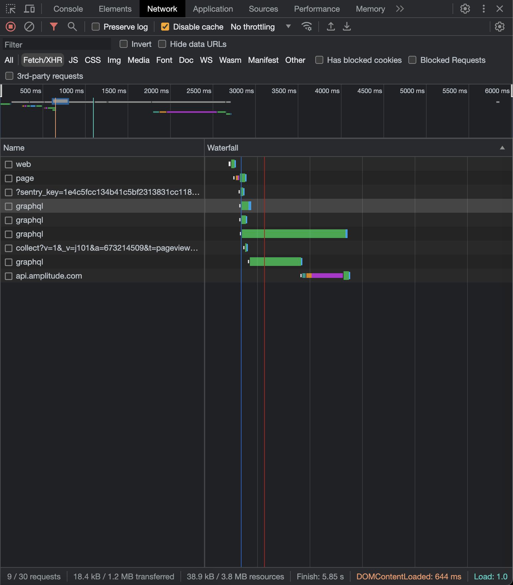
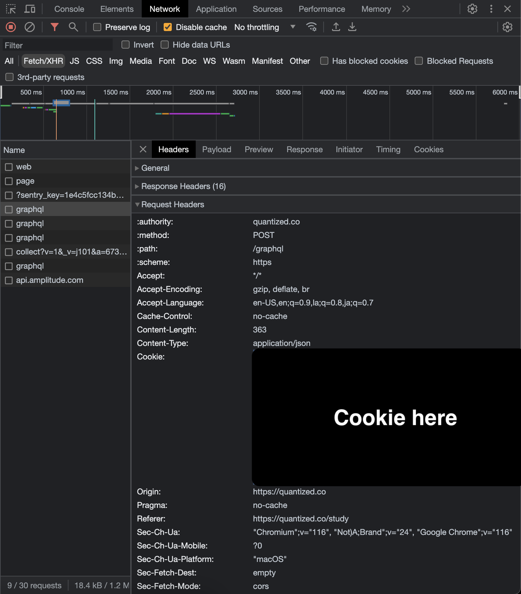

# Quantized to Anki Transfer tool

This is a CLI app I made because I finished the JP1K deck in quantized. I then made another deck for words I get from anime, but reviewing in two apps was really annoying. So I decided to use code to transfer data from Quantized to my local Anki program to I can keep all of my progress, since it is way too late to start from scratch. Hope it works 🤞!

## Preface

Homebrew is an awesome package manager for MacOS, you should definitely use it.

## Setup

### What you'll need

- [Node.js](https://nodejs.org/en/)
  - I recommend using a Node version manager like [Fast Node Manager](https://github.com/Schniz/fnm). After installing it, you just need to run `fnm use` in this repo as the correct Node version is configured in [.node-version](.node-version)
- [PNPM](https://pnpm.io/) via `brew install pnpm`
- [Gum](https://github.com/charmbracelet/gum#installation) via `brew install gum`

### Environment variables

Create a copy of the [.env.example](.env.example) file in the root of this project called `.env`

Here you will put in your session cookie.
How to get your session cookie (in Chrome):

1. Go to https://quantized.co/study
2. Open developer tools (shortcut: <kbd>Cmd</kbd> + <kbd>Option</kbd> + <kbd>I</kbd>)
3. Go to the network tab
4. Activate network log recording (shortcut: <kbd>Cmd</kbd> + <kbd>E</kbd>)
5. Refresh the page (shortcut: <kbd>Cmd</kbd> + <kbd>R</kbd>)
6. Look for the first log named "graphql" and click on it
   
7. Copy the "Cookie" header underneath the "Request Headers"
   
8. Paste the cookie into the `.env` file just created, replacing `session_cookie_here`

## Start the transfer

First you need to download your JP1K progress from Quantized.

All you need to do is run the command: `pnpm run download`

## Transfer progress to Anki

1. Edit the `.env` file to make sure that the `COLLECTION_PATH` is set to the correct collection
2. Run `pnpm run transfer`
3. Now open Anki and your progress should be in the JP1K deck you selected
4. Study using Anki only, no need for Quantized anymore
